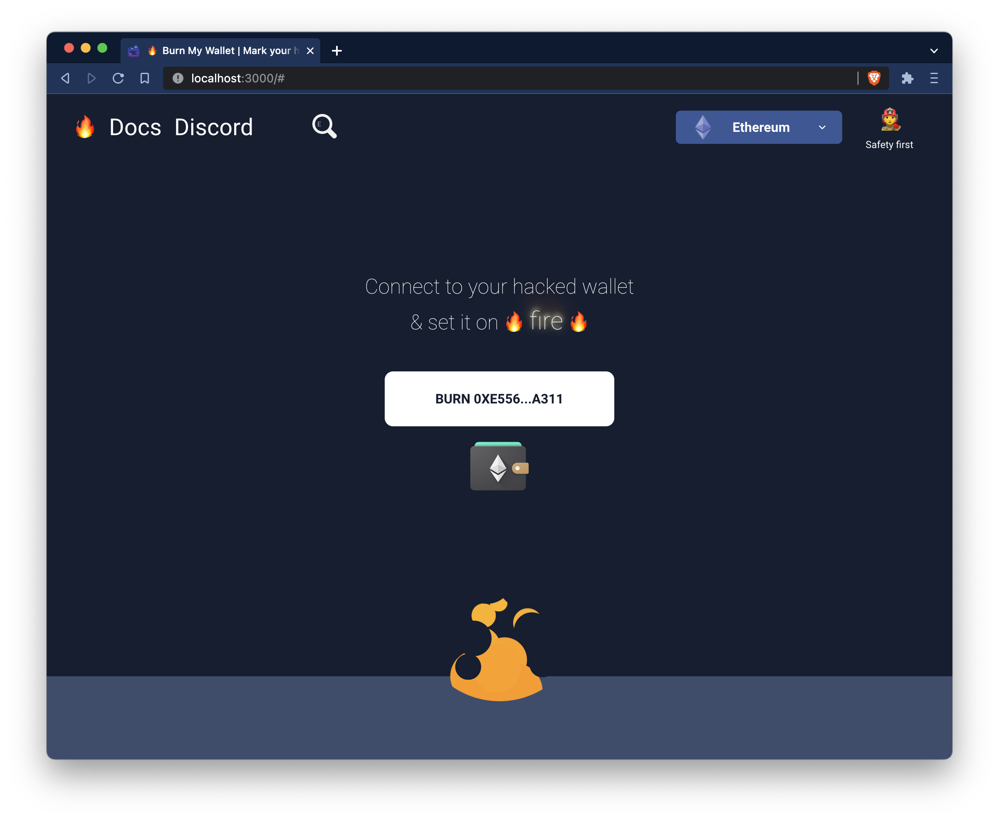

# Burn My Wallet 🔥

With Soul Bound Tokens, Pass cards, and education / work certificates being tied to your account, a hacker gaining access to your account can impersonate you, and gain access to other systems to cause some damage.

Hackers can get your mnemonic, but they can't lock you out of your account. This means if your wallet was hacked, you can still trigger a "kill switch" to mark your wallet as hacked.

Burn My Wallet mints a Soul Bound Token to mark your account as Hacked/Burned.

Burn baby burn: [burnmywallet.com](https://burnmywallet.com/)

## The Graph Protocol

We provide a [Public Graph Protocol Subgraph](https://thegraph.com/hosted-service/subgraph/nikitavr/burn-my-wallet-rinkeby ) to query more data on Burned Wallets for advanced use cases

The code for the Subgraph is available in a [Public Repository](https://github.com/NikitaVr/burnmywallet-graph)

## XMTP Integration

We have modified the sample XMTP Client to include the ability to see if a person you are chatting with has been hacked, to prevent impersonation. [You can check it out here](https://github.com/NikitaVr/example-chat-react-burn-my-wallet)

### License

[`MIT LICENSE`](/LICENSE)
